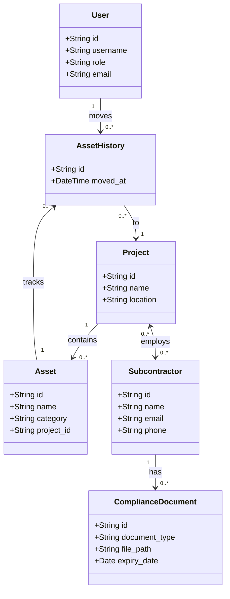
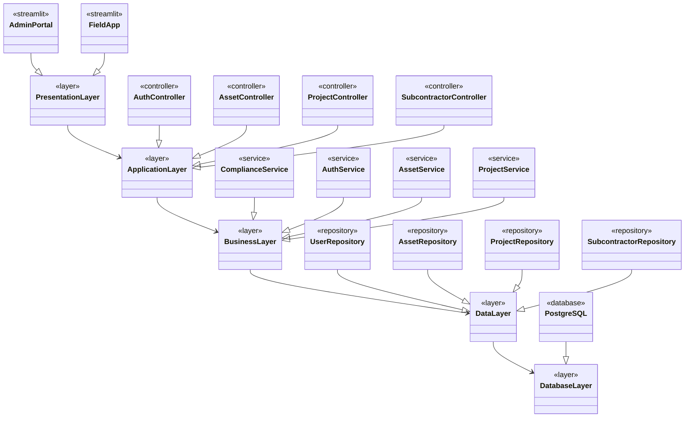
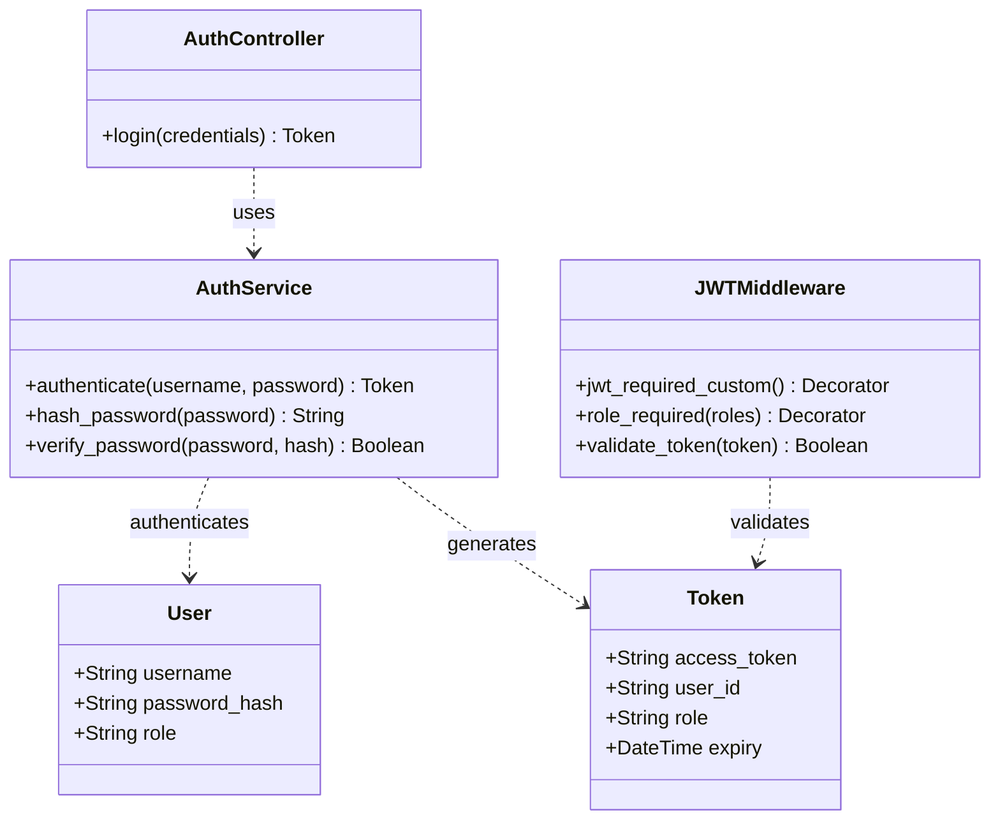
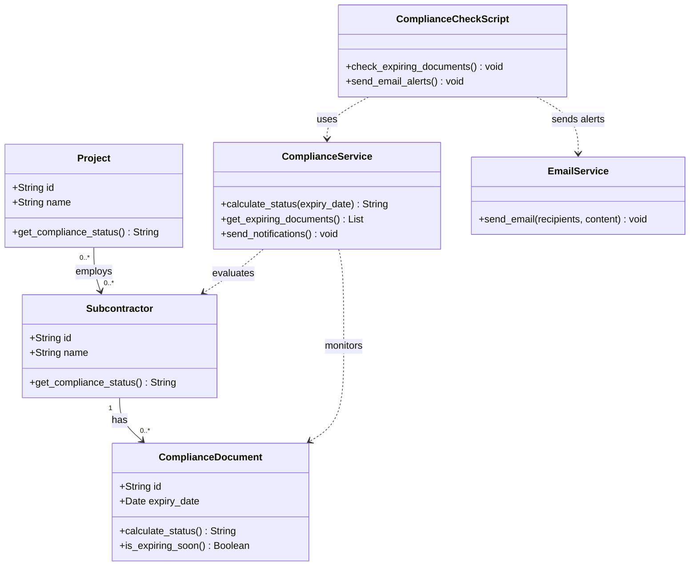
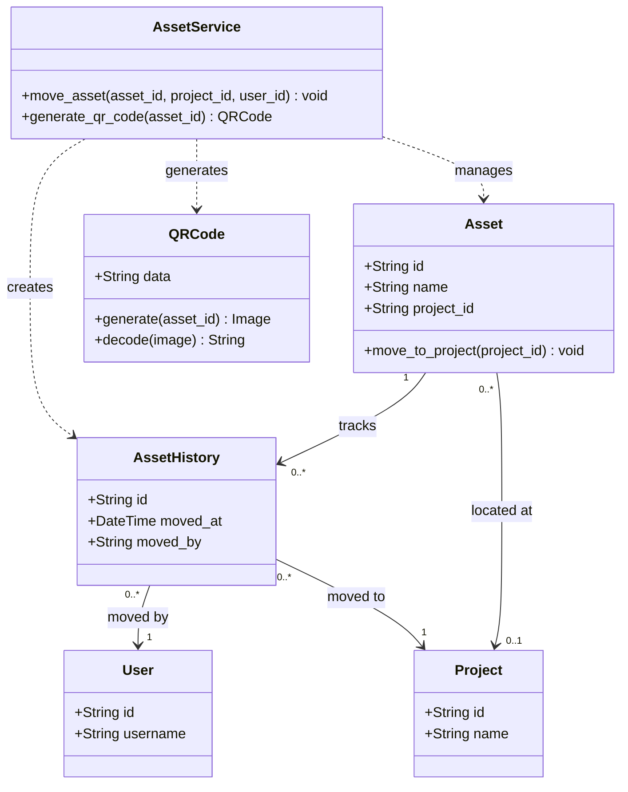

# Site-Steward MVP - UML Class Diagram

## Complete System Class Diagram

```mermaid
classDiagram
    %% Core Domain Models
    class User {
        +String id
        +String username
        +String password_hash
        +String role
        +String email
        +DateTime created_at
        +login(username, password) Token
        +validate_password(password) Boolean
        +get_role() String
    }

    class Project {
        +String id
        +String name
        +String location
        +DateTime created_at
        +List~Asset~ assets
        +List~Subcontractor~ subcontractors
        +add_asset(asset) void
        +remove_asset(asset) void
        +add_subcontractor(subcontractor) void
        +get_compliance_status() String
    }

    class Asset {
        +String id
        +String name
        +String category
        +String project_id
        +DateTime created_at
        +DateTime updated_at
        +List~AssetHistory~ history
        +generate_qr_code() QRCode
        +move_to_project(project_id, user_id) void
        +get_current_location() Project
        +get_movement_history() List~AssetHistory~
    }

    class Subcontractor {
        +String id
        +String name
        +String email
        +String phone
        +DateTime created_at
        +List~ComplianceDocument~ documents
        +List~Project~ projects
        +add_document(document) void
        +get_compliance_status() String
        +is_compliant() Boolean
    }

    class ComplianceDocument {
        +String id
        +String subcontractor_id
        +String document_type
        +String file_path
        +Date expiry_date
        +DateTime uploaded_at
        +calculate_status() String
        +is_expired() Boolean
        +days_until_expiry() Integer
        +is_expiring_soon() Boolean
    }

    class AssetHistory {
        +String id
        +String asset_id
        +String project_id
        +String moved_by
        +DateTime moved_at
        +get_moved_by_user() User
        +get_project() Project
        +get_asset() Asset
    }

    class Place {
        +String id
        +String name
        +String location
        +List~Asset~ assets
        +add_asset(asset) void
        +remove_asset(asset) void
    }

    %% Service Layer
    class ComplianceService {
        <<service>>
        +calculate_status(expiry_date) String
        +calculate_subcontractor_status(documents) String
        +get_expiring_documents(days) List~ComplianceDocument~
        +send_expiry_notifications() void
    }

    class AuthService {
        <<service>>
        +authenticate(username, password) Token
        +generate_token(user) String
        +validate_token(token) Boolean
        +hash_password(password) String
        +verify_password(password, hash) Boolean
    }

    class AssetService {
        <<service>>
        +create_asset(name, category) Asset
        +move_asset(asset_id, project_id, user_id) void
        +generate_qr_code(asset_id) QRCode
        +get_asset_details(asset_id) Asset
        +list_assets() List~Asset~
    }

    class ProjectService {
        <<service>>
        +create_project(name, location) Project
        +get_project_compliance(project_id) ComplianceStatus
        +assign_subcontractor(project_id, subcontractor_id) void
        +list_projects() List~Project~
    }

    %% API Layer
    class AuthController {
        <<controller>>
        +POST login(credentials) TokenResponse
        +POST logout() void
        +GET validate_token() Boolean
    }

    class AssetController {
        <<controller>>
        +GET list_assets() List~Asset~
        +POST create_asset(data) Asset
        +GET get_asset(asset_id) Asset
        +POST move_asset(asset_id, project_id) Response
    }

    class ProjectController {
        <<controller>>
        +GET list_projects() List~Project~
        +POST create_project(data) Project
        +GET get_compliance(project_id) ComplianceStatus
    }

    class SubcontractorController {
        <<controller>>
        +GET list_subcontractors() List~Subcontractor~
        +POST create_subcontractor(data) Subcontractor
        +POST upload_document(subcontractor_id, file) Document
    }

    %% Middleware
    class JWTMiddleware {
        <<middleware>>
        +jwt_required_custom() Decorator
        +role_required(roles) Decorator
        +get_current_user_id() String
        +get_current_user_role() String
        +validate_token(token) Boolean
    }

    %% Frontend Components
    class AdminPortal {
        <<streamlit>>
        +show_login_page() void
        +show_home_page() void
        +show_asset_management() void
        +show_subcontractors() void
        +show_compliance_upload() void
        +show_project_hub() void
    }

    class FieldApp {
        <<streamlit>>
        +show_login_page() void
        +show_main_navigation() void
        +show_qr_scanner() void
        +show_compliance_viewer() void
    }

    class APIClient {
        <<utility>>
        +login(username, password) Token
        +get(endpoint) Response
        +post(endpoint, data) Response
        +put(endpoint, data) Response
        +delete(endpoint) Response
        +validate_token() Boolean
    }

    class QRScanner {
        <<utility>>
        +scan_qr_code() String
        +decode_qr_data(image) String
        +validate_qr_code(data) Boolean
    }

    %% Database Layer
    class Database {
        <<singleton>>
        +get_session() Session
        +init_db() void
        +reset_db() void
        +close_session() void
    }

    %% Relationships - Core Domain
    User "1" --> "0..*" AssetHistory : moves assets
    Project "1" --> "0..*" Asset : contains
    Project "0..*" --> "0..*" Subcontractor : employs
    Asset "1" --> "0..*" AssetHistory : has history
    Subcontractor "1" --> "0..*" ComplianceDocument : has documents
    AssetHistory "0..*" --> "1" Project : moved to
    AssetHistory "0..*" --> "1" User : moved by
    Place "1" --> "0..*" Asset : contains (legacy)

    %% Relationships - Services
    ComplianceService ..> ComplianceDocument : uses
    ComplianceService ..> Subcontractor : uses
    AuthService ..> User : uses
    AssetService ..> Asset : uses
    AssetService ..> AssetHistory : creates
    ProjectService ..> Project : uses
    ProjectService ..> Subcontractor : uses

    %% Relationships - Controllers
    AuthController ..> AuthService : uses
    AuthController ..> JWTMiddleware : protected by
    AssetController ..> AssetService : uses
    AssetController ..> JWTMiddleware : protected by
    ProjectController ..> ProjectService : uses
    ProjectController ..> JWTMiddleware : protected by
    SubcontractorController ..> ProjectService : uses
    SubcontractorController ..> JWTMiddleware : protected by

    %% Relationships - Frontend
    AdminPortal ..> APIClient : uses
    FieldApp ..> APIClient : uses
    FieldApp ..> QRScanner : uses
    APIClient ..> AuthController : calls
    APIClient ..> AssetController : calls
    APIClient ..> ProjectController : calls
    APIClient ..> SubcontractorController : calls

    %% Relationships - Database
    Database ..> User : manages
    Database ..> Project : manages
    Database ..> Asset : manages
    Database ..> Subcontractor : manages
    Database ..> ComplianceDocument : manages
    Database ..> AssetHistory : manages
    Database ..> Place : manages

    %% Notes
    note for User "Roles: admin, foreman\nAuthentication via JWT"
    note for ComplianceDocument "Status: RED (expiring ≤30 days)\nGREEN (valid >30 days)"
    note for Asset "Categories: Heavy Equipment,\nPower Equipment, Safety Equipment"
    note for JWTMiddleware "Token expiration: 24 hours\nBcrypt password hashing"
```

## Simplified Domain Model

## Architecture Layers Diagram

## Authentication Flow Diagram

## Compliance Monitoring Diagram

## Asset Tracking Flow Diagram

## Usage Instructions

### Viewing the Diagrams

These Mermaid diagrams can be viewed in:

1. **GitHub/GitLab**: Automatically rendered in markdown files
2. **VS Code**: Install "Markdown Preview Mermaid Support" extension
3. **Online**: Copy to https://mermaid.live/
4. **Documentation Sites**: Most support Mermaid rendering

### Diagram Descriptions

1. **Complete System Class Diagram**: Shows all classes, their attributes, methods, and relationships
2. **Simplified Domain Model**: Core domain entities and relationships
3. **Architecture Layers Diagram**: System organized by architectural layers
4. **Authentication Flow Diagram**: Classes involved in authentication
5. **Compliance Monitoring Diagram**: Compliance checking system
6. **Asset Tracking Flow Diagram**: Asset movement and QR code system

### Legend

- `<<service>>`: Service layer classes
- `<<controller>>`: API controller classes
- `<<middleware>>`: Middleware components
- `<<streamlit>>`: Streamlit frontend applications
- `<<utility>>`: Utility classes
- `<<repository>>`: Data access layer
- `<<database>>`: Database layer
- `<<layer>>`: Architectural layer
- `-->`: Association/Dependency
- `..>`: Uses/Depends on
- `--|>`: Inheritance/Implementation

---

## Related Documentation
- [System Overview](01_SYSTEM_OVERVIEW.md)
- [Architecture](02_ARCHITECTURE.md)
- [Database Schema](04_DATABASE_SCHEMA.md)
- [API Reference](03_API_REFERENCE.md)
